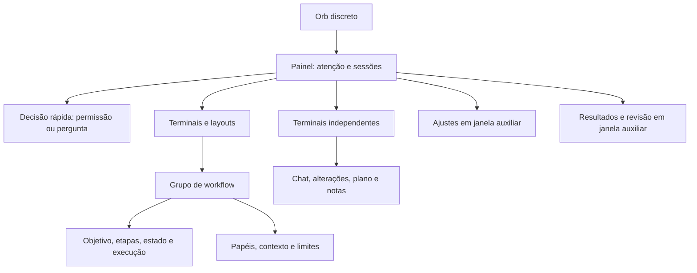

# Lume Orb — análise de design e uso

24/09/2026 · Modo de uso: operação de um aplicativo desktop.

Método: avaliações independentes de design (`orb_design_review`) e evidência técnica (`orb_evidence_review`), seguidas de síntese. A avaliação de design foi encerrada antes da leitura do detector.

## Parecer

O Orb tem uma proposta clara: acompanhar agentes sem tomar o desktop e abrir conversas em terminais independentes. A maior oportunidade está em organizar melhor **atenção imediata, trabalho por sessão e administração do produto**.

Minha recomendação é preservar a cápsula, os terminais separados, o docking e a identidade visual. Sessões precisa de uma hierarquia orientada a decisões. Configuração, consulta de resultados e operação de workflows precisam de mais espaço e de um caminho mais previsível.

Janelas auxiliares pertencem ao próprio modo Orb. Todos os recursos continuam acessíveis por ele, com os limites reais de cada integração. Essa arquitetura mantém o comportamento original do Lume.

## Escopo e evidência

- Fonte atual de `src/routes/+page.svelte`, `TerminalWindow.svelte`, `WorkflowBridgeWindow.svelte`, `StartupModeChooser.svelte` e componentes auxiliares; contratos e produto conferidos em `docs/PRODUCT.md`.
- Inspeção de 47 capturas válidas de estados representativos: painel, subáreas de Ajustes, terminais, decisões, modelos, notas, plano, handoff e workflow. Aparências clara e escura foram observadas.
- Componentes reais renderizados em Chromium, com bridge Tauri e sessões ilustrativas. Isso permite avaliar composição, conteúdo e hierarquia. As conversas ilustrativas em inglês não são tratadas como falha de tradução.
- Um dos 48 arquivos de captura mostrou uma fixture incompleta da ponte; foi descartado e substituído por uma captura válida. O cenário de modelo também foi corrigido antes da avaliação final. Nenhum desses erros é atribuído ao produto.
- Docking nativo, múltiplos monitores, escala do sistema, atalhos globais, retomada de processos e leitores de tela não foram exercitados. O comportamento desses recursos foi analisado pela fonte.
- Workspace central e landing estão fora do escopo. A referência ao centro de revisão do Workspace serve apenas para identificar uma possibilidade de reutilização no Orb. GitHub/Jira/Relay não têm uma tela implementada neste fluxo para avaliação visual.

As capturas locais ficam em `.impeccable/review/orb-20260924/`. Esta análise não modifica a implementação.

## O que já funciona bem

1. **Presença discreta:** cápsula, mascote e estados reconhecíveis dão identidade ao Lume sem impor uma janela grande permanentemente.
2. **Organização por conversa:** terminais independentes, layouts, paleta e atalhos apoiam o trabalho de quem acompanha vários agentes.
3. **Controle contextual:** origem, acesso e ações dependem da sessão; handoff informa destino e permite inspecionar o conteúdo enviado. Esses fundamentos devem ser mantidos.

## Prioridades

### 1. P1 — Pendências precisam vir antes da resposta anterior

**Observado:** ao expandir uma sessão, a última resposta aparece antes das ações e da permissão ou pergunta pendente. Nas capturas, código e texto da resposta anterior ocupam boa parte da altura antes de Permitir/Recusar ou das opções da pergunta. O banner anuncia a pendência, mas a decisão está distante dele.

**Impacto provável:** o usuário abre o Orb para destravar um agente e precisa procurar a ação no conteúdo da sessão.

**Proposta:** uma seção “Precisa de você”, com motivo, agente e projeto. Dentro do detalhe, apresentar primeiro a decisão e seu contexto; depois, atividade e última resposta recolhível. Em trabalho normal, manter a lista breve. Busca e filtros podem aparecer quando a quantidade de sessões justificar.

**Critério para a reformulação:** identificar a pendência e chegar à decisão sem atravessar a resposta anterior; permissões continuam específicas da sessão.

Evidência: `src/routes/+page.svelte:3099`, `:3207`, `:3225`; [permissão](../.impeccable/review/orb-20260924/13-permission.png), [pergunta](../.impeccable/review/orb-20260924/14-question.png).

### 2. P1 — Legibilidade, conteúdo e camadas dos terminais

**Observado:** vários textos operacionais usam 7–11px. O corpo do terminal parte de 9px e cresce com a largura; já existe ajuste de tamanho de texto. Sessões e Resultados imprimem Markdown cru, enquanto o chat do terminal formata o mesmo conteúdo. O botão de papel do workflow aparece sobre o diálogo de handoff. A ação “Salvar em Notas” ficou cortada na aba Plano.

**Proposta:** manter uma opção compacta e definir uma escala confortável para leitura; tornar o ajuste existente mais encontrável. Usar resumo limpo na lista e o mesmo renderizador de conteúdo no detalhe. Padronizar a ordem das camadas para que o diálogo ativo ocupe a frente e seus controles permaneçam livres. Reorganizar o cabeçalho de Plano para acomodar suas ações.

**Conferência funcional necessária:** o handler global de Escape no terminal pode interromper um prompt sem consultar os estados dos diálogos. A fonte sustenta o risco; não foi demonstrado em execução nativa. Escape deve resolver primeiro a camada ativa.

**Teclado observado no navegador:** fechar a paleta por Escape deixa o foco no corpo da página; Escape não fecha o seletor de cor. O seletor de opções muda sua seleção visual sem comunicar a opção ativa pela estrutura ARIA inspecionada. Alguns switches de Ajustes têm descrição visual sem associação ao checkbox. Incluir retorno de foco, fechamento de camada e nomes acessíveis nessa padronização. Há suporte de teclado e foco visível existente para aproveitar.

**Critério:** conteúdo essencial legível no tamanho suportado, ações sem cortes e diálogos sem controles de fundo sobrepostos.

Evidência: `src/routes/+page.svelte:3116`, `:3581`; `TerminalWindow.svelte:1327`, `:4023`, `:4144`, `:4501`, `:4684`; [Plano](../.impeccable/review/orb-20260924/30-terminal-plan.png), [handoff](../.impeccable/review/orb-20260924/35-terminal-handoff.png).

### 3. P1 — Ajustes e consulta longa precisam de espaço próprio

**Observado:** o painel tem largura prevista de 392px, altura limitada e corpo de até 431px. Esse espaço recebe dez grupos de Ajustes e quatro famílias de Resultados. “Preferências” mistura idioma, aparência, som, monitores, retenção e destino de abertura. “Interface” contém integrações Companion.

**Proposta para Ajustes:** janela auxiliar redimensionável, com busca e categorias: Integrações, Aparência, Comportamento e alertas, Projetos, Dispositivos, Atalhos e Sobre. Companions e detectores ficam em Integrações; mobile e computadores remotos em Dispositivos. Os atalhos rápidos continuam no Orb.

**Proposta para Resultados:** últimos acontecimentos no painel e uma biblioteca de consulta com filtros por projeto, sessão, tipo e período; resposta formatada e ação clara para continuar a sessão. As notas ganham desfazer exclusão.

**Critério:** encontrar uma preferência ou resultado conhecido sem percorrer seções sem relação com a tarefa.

Evidência: `src/routes/+page.svelte:3453`, `:3613`, `:3714`, `:4590`; [Preferências](../.impeccable/review/orb-20260924/12-settings-04.png), [Resultados](../.impeccable/review/orb-20260924/10-results.png).

### 4. P1 — Workflow precisa de uma visão do grupo

**Observado:** limites ficam no Orb, papéis nos terminais, conexões e execução na ponte, histórico em Resultados. O objetivo e o botão para iniciar ficam dentro de “Prévia”. Cada componente pode ser entendido isoladamente, mas operar o conjunto exige lembrar onde cada ação está.

**Proposta:** janela do grupo com objetivo, sequência de agentes, etapa atual, pendências e próxima ação. Iniciar, Pausar e Retomar ficam em posição estável. A ponte continua como editor contextual da transferência; o papel continua associado ao agente. O fluxo de montagem fica explícito: papéis → conexões → revisão do contexto e limites → iniciar.

Os seis tipos de contexto já têm rótulos: preservá-los. Mostrar as seleções detalhadas quando a pessoa personalizar um preset reduz o número de decisões simultâneas. A prévia exata continua disponível antes de executar.

As pontas da ponte também precisam identificar **sessão e papel**: hoje priorizam o nome do projeto, produzindo “Lume → Lume” quando dois agentes trabalham no mesmo projeto. Projeto pode ficar como informação secundária. Os dois modos Manual/Automático devem ter rótulos reconhecíveis.

**Critério:** responder na mesma superfície “quem está trabalhando, o que vem depois e o que depende de mim?”.

Evidência: `src/routes/+page.svelte:2912`; `TerminalWindow.svelte:3170`; `WorkflowBridgeWindow.svelte:620`; [limites](../.impeccable/review/orb-20260924/25-workflow-settings.png), [ponte](../.impeccable/review/orb-20260924/26-workflow-bridge-valid.png), [execução](../.impeccable/review/orb-20260924/27-workflow-controls.png).

### 5. P2 — Recuperar janelas e orientar o primeiro uso

**Observado:** em Terminais, “Abrir” fica desabilitado quando a janela já existe; o tooltip manda fechá-la pelo X antes de abrir novamente. O estado vazio de Sessões pede aguardar detecção, sem uma ação principal naquele espaço.

**Proposta:** mostrar Aberto/Minimizado e oferecer “Mostrar” ou “Trazer à frente”; o mesmo comando deve ser acessível na paleta. No vazio, oferecer “Abrir sessão” ou “Conectar agente” conforme o estado real das integrações, com uma explicação breve da detecção.

**Critério:** recuperar uma conversa existente pelo Orb e sair do primeiro vazio por um caminho evidente.

Evidência: `src/routes/+page.svelte:3314`, `:3439`; [Terminais](../.impeccable/review/orb-20260924/09-terminals.png), [vazio](../.impeccable/review/orb-20260924/15-empty.png).

## Inventário e decisão por tela

| Tela ou fluxo | Direção recomendada |
| --- | --- |
| Orb recolhido | Preservar. Evidenciar pendências sem confundir sua quantidade com agentes ativos. |
| Escolha Orb/Workspace | Preservar as duas prévias. Complementar a chegada ao modo escolhido com uma primeira ação útil. |
| Sessões | Reformular a hierarquia por necessidade de atenção; reduzir prévias repetidas. |
| Detalhe, aprovação e perguntas | Reformular: decisão primeiro, resposta anterior recolhível, ação principal identificável. |
| Renomear, continuar e encerrar | Refinar. Manter confirmação de encerramento e evitar várias edições simultâneas no mesmo detalhe. |
| Nova sessão/retomar | Refinar recentes e contexto do projeto; deixar instalação, conexão e disponibilidade distinguíveis. |
| Paleta e atalhos | Preservar; acrescentar foco de janelas abertas e atalhos para categorias de Ajustes. |
| Terminais e layouts | Mostrar estado da janela, focar/restaurar, identificar conjunto e disposição salva. |
| Chat independente | Preservar a estrutura; rever densidade, leitura prolongada, escala e camadas. |
| Alterações | Ampliar a utilidade: hoje lista caminhos e contagens. Oferecer abrir origem e inspeção do diff, quando disponível, dentro do modo Orb. Reutilizar a lógica do centro de revisão existente no Workspace. |
| Plano e trabalho atual | Refinar a relação entre resumo de progresso e documento; corrigir o corte da ação do cabeçalho. |
| Notas do terminal | Preservar edição e fixação; destacar salvar/cancelar, oferecer desfazer e reduzir competição com o prompt. |
| Modelo/raciocínio | Preservar o diálogo simples e “Próximo prompt”; melhorar acesso e consistência de rótulos. Corrigir sobreposição do botão de papel. |
| Handoff manual | Preservar destino e prévia; deixar inclusão de conteúdo e resultado do envio explícitos. Corrigir camadas. |
| Papel e ponte de Workflow | Manter edição contextual e reunir a operação do grupo em uma superfície estável. |
| Limites de Workflow | Mover para seção avançada do grupo, mantendo padrões e aprovação visíveis. |
| Resultados, notas salvas e histórico | Reformular para consulta por contexto, com filtros e conteúdo formatado. |
| Ajustes: Agentes | Organizar por disponibilidade/conexão/capacidade, mantendo diagnóstico. |
| Ajustes: Detectores e Interface | Reagrupar em Integrações; explicar finalidade de Companion e manifesto no ponto de ação. |
| Ajustes: Preferências | Dividir Aparência e Comportamento/alertas em uma janela apropriada. |
| Ajustes: Perfis por projeto | Explicitar herança de valores globais. Diferenciar “Salvo” de “Aplicar disposição agora”. |
| Ajustes: Computadores remotos | Fluxo descobrir → parear → verificar; mostrar conexão textual e o escopo atual de acesso somente leitura. |
| Ajustes: Mobile | Fluxo ativar → parear → escolher permissões; distinguir dispositivo pareado, conectado e revogado. |
| Ajustes: Sobre e Redefinir | Manter atualização e confirmação de reset; agrupar manutenção em localização previsível. |

A aba Alterações foi inspecionada pela fonte e no estado vazio. A captura com nome “populated” não carregou uma lista populada e não é usada como prova desse estado. A oportunidade de compartilhar revisão decorre do template do terminal (`:3524`) e do uso de `WorkspaceReviewCenter` em `WorkspaceWindow.svelte:2823`.

## Arquitetura proposta para o modo Orb

As janelas compartilham dados, capacidades e componentes do Lume. Fechá-las devolve a pessoa ao conjunto de terminais e ao Orb, preservando a seleção e o contexto.

## Ordem de execução sugerida

1. **Clareza imediata:** pendência antes da resposta, Markdown, camadas dos diálogos, ação de Plano e “Mostrar terminal”. Conferir prioridade do Escape na janela nativa.
2. **Estrutura:** Ajustes e Resultados em auxiliares redimensionáveis; categorias, busca, filtros e estados de primeiro uso.
3. **Orquestração:** visão do grupo Workflow, execução em local estável e integração de revisão de arquivos no Orb.
4. **Consistência:** escala confortável/compacta, nomenclatura, foco, desfazer e feedback de salvamento.

## Avaliação heurística

Inspeção qualitativa, sem teste com usuários. Escala de 0 a 4 por heurística; todas se aplicam ao modo Orb.

| Heurística | Nota | Principal observação |
| --- | ---: | --- |
| Visibilidade do estado | 3 | Sessões e banners funcionam; janelas e grupo Workflow precisam de estado mais claro. |
| Linguagem e tarefa | 2 | Execução dentro de Prévia e Interface como Companions tornam destinos menos previsíveis. |
| Controle e liberdade | 2 | Falta foco de janela no hub e recuperação de exclusões pessoais. |
| Consistência | 2 | Conteúdo formatado e camadas variam entre superfícies. |
| Prevenção de erros | 3 | Capacidades, prévia e confirmações são boas bases. |
| Reconhecimento | 2 | Operação distribuída entre superfícies exige memória. |
| Flexibilidade e eficiência | 3 | Paleta, atalhos, zoom, perfis e layouts ajudam. |
| Hierarquia e economia visual | 2 | Conteúdo anterior compete com decisão; tarefas longas ficam comprimidas. |
| Recuperação de erros | 2 | Diagnóstico existe, mas algumas mensagens ainda não indicam o próximo passo. |
| Ajuda e descoberta | 2 | Vazio inicial e descoberta de recursos avançados precisam de orientação. |
| **Total** | **23/40** | **Base útil; melhorias relevantes de organização e uso.** |

Nenhum P0 foi estabelecido. Os quatro P1 são prioridades de reformulação de alto impacto; P2 cobre continuidade e descoberta. A nota não mede estabilidade do software nem desempenho dos agentes.

## Carga, perfis de uso e jornada

- **Desenvolvedor experiente:** paleta, atalhos e disposição de janelas funcionam a favor. Pendências distantes e “Abrir” desabilitado aumentam o custo de retomar o trabalho.
- **Primeiro contato:** a escolha Orb/Workspace é compreensível. O vazio precisa distinguir ausência de sessão, integração desconectada e possível falha de detecção.
- **Uso por teclado ou com leitura ampliada:** aproveitar o suporte existente e uniformizar foco, retorno ao acionador, fechamento de camadas e tamanho do texto.

A carga aumenta em configurações e workflow: dez grupos de Ajustes, preferências extensas, seis tipos de contexto combinados a presets e execução. Revelar detalhes conforme a tarefa e reunir decisões relacionadas reduz o esforço de memorizar estados entre janelas.

A jornada desejada é: perceber o agente → identificar quem precisa de ação → decidir → acompanhar o trabalho → compreender o resultado → continuar. A hierarquia de cada tela deve tornar essa sequência previsível.

## Conferência técnica independente

O detector foi executado uma vez em oito arquivos de markup do Orb: **21 avisos, nenhuma severidade de erro**. Regras: 10 transições de layout, 7 marcações laterais, 2 ocorrências de família tipográfica, 1 animação dos pontos de atividade e 1 texto de processamento com gradiente.

Esses avisos não equivalem a 21 defeitos de produto. Inter é adequada a um utilitário desktop; citações, permissões e prévias justificam seus delimitadores. Os pontos animados sinalizam atividade. Transições de largura/altura merecem medição se houver um trabalho de desempenho, mas esta revisão não demonstrou travamentos nem mediu frames.

A inspeção independente do navegador confirmou texto funcional pequeno, pouca distinção da aba ativa no tema escuro, a ordem das decisões, Markdown cru e lacunas de foco/semântica. Os overlays de inspeção foram executados em Sessões, Preferências, Terminal e Ponte. Seus contadores são sinais por elemento e não devem ser somados ao detector da fonte.

Não foi medida conformidade normativa de contraste. A recomendação é conferir cores de estado e seleção por tema, mantendo texto/ícone como pistas, e aumentar seletivamente a legibilidade. A densidade desktop e o uso com mouse devem orientar os alvos; não há fundamento para aplicar dimensões de interface touch a todos os controles.

## Encaminhamento

A primeira entrega recomendada reúne as correções de decisão e leitura com “Mostrar terminal”. Depois, a janela de Ajustes estabelece o padrão das auxiliares. A revisão de Workflow pode seguir usando os papéis, limites e mecanismos de contexto já existentes.

As perguntas de escopo para uma implementação futura são quais auxiliares serão priorizadas e qual densidade deve ser o padrão. Elas não impedem a análise solicitada nem exigem uma decisão antes de registrar estas recomendações.
