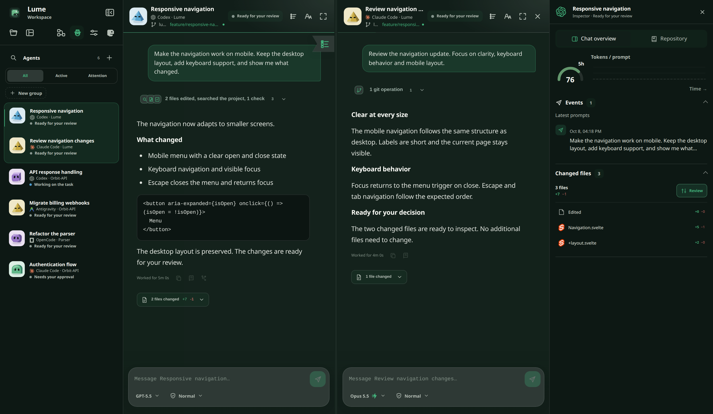
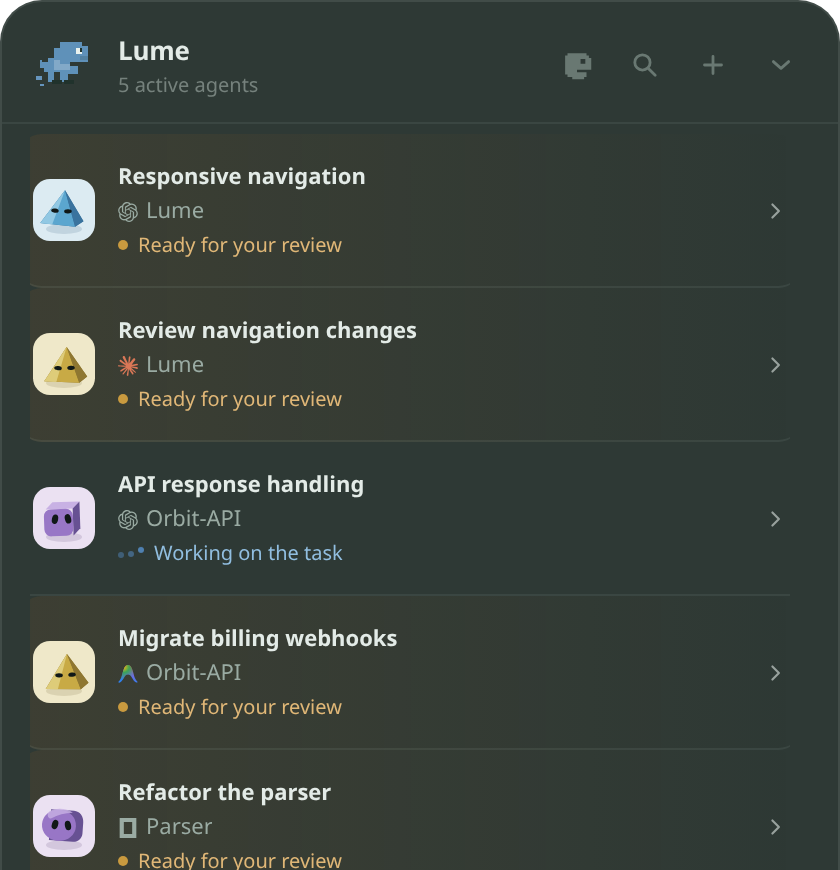
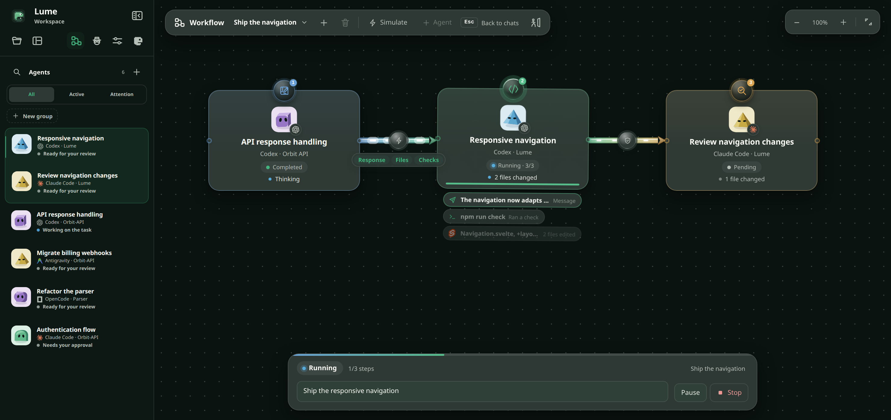

<p align="center">
  
</p>

<h1 align="center">Lume</h1>

<p align="center">
  A local-first command center for every AI coding agent on your computer.
</p>

<p align="center">
  <a href="https://github.com/Lume-agents/Lume/releases/latest"><strong>Download the latest release</strong></a>
  · Windows · Linux · macOS (preview) · Android
</p>

Lume watches the agent sessions you already run (Claude Code, Codex, Antigravity, OpenCode and more), shows which ones are working, waiting or need you, and lets you continue them from one place. It needs no account and has no Lume-hosted service: desktop data stays on the machine, and prompts follow the connection of the agent you choose.

<p align="center">
  
</p>
<p align="center"><sub>Screenshots use illustrative sessions generated by <code>scripts/site-capture</code>.</sub></p>

## Three ways to use it

### Orb

A small capsule at the top of the screen. Its color, counter, sound and notifications reflect what needs attention. Expand it to see every session, approve supported actions, continue a chat, read final responses, or open floating terminals. Sessions show the same groups you create in the Workspace.

<p align="center">
  
</p>

### Workspace

A full window for working with several agents at once.

- **Chats side by side:** up to three panes, rearranged by dragging a session from the sidebar or a pane header. Each chat keeps Markdown, images, commands, changed files, TO DO and GOAL progress, rate limits and prompt queueing.
- **Sidebar groups:** create groups, drag agents into them, reorder and collapse them. Groups are stored locally and shown in the Orb too.
- **Inspector:** token usage, recent prompts, changed files, subagents, the agent's MCP servers with connection status, and the repository (changes, commits, pull requests, issues, Actions).
- **Review center:** per-file review with syntax-colored diffs, line comments you can send back to the agent, and a Git view of the working tree.
- **Slash commands read from the agent itself.** Lume adds `/model`, `/clear` (starts a new conversation in the pane), `/mcp` (servers and their tools) and a few window commands.
- **Find in chat:** `Ctrl+F` / `Cmd+F`.
- **GitHub without leaving the chat:** a pull request or issue URL mentioned in a chat opens a preview with status, checks, labels and description. From the Changes tab you can commit the files you tick; Lume never pushes.
- **Session environments:** the dev servers and databases each session started, with ports and a stop button.
- **External CLIs stay untouched.** A Codex or Claude Code CLI you started yourself is monitored read-only until you explicitly transfer it to Lume.

### Workflow board

A canvas for coordinating agents. Drop sessions onto it, give each a role (Planner, Implementer, Reviewer, Tester, Researcher or custom), and draw arrows for the order. Each arrow controls what is handed over (context policy and the files, checks, plan or diffs to include) and whether to ask for your approval first. Cards show what each agent is doing as it works, and arrows light up as results travel.

<p align="center">
  
</p>

Lume builds a sanitized context package from the source result instead of copying the whole conversation or private reasoning. Runs are stored locally, recover after a restart, and are limited by guardrails on transitions, retries, step duration, sensitive handoffs and low rate limits. See [docs/WORKFLOW_BOARD.md](docs/WORKFLOW_BOARD.md).

## Supported agents

| Agent | What Lume does |
| --- | --- |
| Claude Code | Monitors CLI sessions; sessions opened by Lume can run without a terminal, with prompts, permissions, model and effort, Fast mode, task list and MCP status |
| Codex | Monitors the CLI and VS Code; sessions controlled by Lume use the local App Server with prompts, queue, steer, approvals, model and effort |
| Antigravity CLI | Hook activity and status, model and permission selection, resume of the latest conversation per workspace |
| OpenCode | Prompts, cancellation and slash commands through its ACP server |
| DeepSeek Harness, Gemini CLI (legacy) | Process monitoring; Gemini is never controlled |
| ChatGPT, Claude, DeepSeek and Gemini on the web | Status, final response and prompts through the Chromium Companion |

Lume shows only actions the current session supports and never simulates an approval an agent cannot perform. Details, including the Antigravity hook and its automatic tool approval, are in [docs/AGENT_SOURCES.md](docs/AGENT_SOURCES.md).

## Install

The [latest release](https://github.com/Lume-agents/Lume/releases/latest) provides a Windows installer (`.exe`), `.deb`, `.rpm`, a portable Linux AppImage, and the Android app (`Lume-Mobile.apk`).

**macOS (preview).** Apple Silicon and macOS 15+. Until the build is signed ([#13](https://github.com/Lume-agents/Lume/issues/13)), install from the terminal, because Gatekeeper blocks the `.dmg`:

```bash
curl -fsSL https://raw.githubusercontent.com/Lume-agents/Lume/main/scripts/install-macos.sh | sh
```

Running it again updates to the latest release. Lume also checks for updates itself (**Settings → About**).

**Connect your agents.** Open **Settings** and connect the integrations you use. After connecting Codex for the first time, run `/hooks` inside Codex and trust the **Lume** hook. The browser Companion is covered in [docs/AGENT_SOURCES.md](docs/AGENT_SOURCES.md), GitHub in [docs/GITHUB.md](docs/GITHUB.md) and Linux display notes in [docs/DEVELOPMENT.md](docs/DEVELOPMENT.md).

**Phone.** Enable **Settings → Mobile access** and scan the QR code. Access is off by default and uses a paired, encrypted connection over the local network.

## Keyboard shortcuts

| Action | Shortcut |
| --- | --- |
| Open Lume | `Ctrl+Alt+Shift+L` |
| Open the command palette | `Ctrl+Shift+Space` |
| Start a new session | `Ctrl+Alt+Shift+N` |
| Open the Whiteboard | `Ctrl+Alt+Shift+B` |

All of them can be changed in **Settings → Keyboard shortcuts**.

## Privacy

Everything stays on the machine. Desktop integrations listen only on localhost. The mobile gateway opens port `43124` on the local network only after you enable it, accepts only paired devices, and encrypts payloads with keys from the one-time QR code. The public PWA contains static files only.

Live messages are not copied into a Lume transcript database. SQLite stores preferences, workflow definitions and recovery state, plans and notes, sanitized activity history and results you saved explicitly. Private model reasoning is never available to Lume. GitHub access reuses your own GitHub CLI login and no token reaches the webview or an agent. See [Product](docs/PRODUCT.md) and [Privacy](docs/PRIVACY.md).

## Contributing

Requirements are Node.js 22+, stable Rust and the Tauri system dependencies.

```bash
npm install
npm run check
npm run tauri dev
```

[docs/DEVELOPMENT.md](docs/DEVELOPMENT.md) covers building installers, releases and external detectors, and [CONTRIBUTING.md](CONTRIBUTING.md) the contribution process. The marketing website lives in the private `Lume-agents/lume-website` repository; this repository holds the desktop app, mobile clients, Node and the shared agent integrations.
